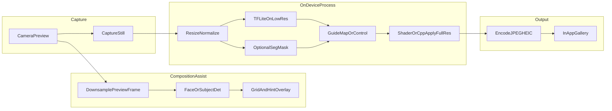

# Flutter 端侧 AI 相机（高级感成片）实施计划

> 本文档为本仓库内的开发依据；若与 Cursor 侧计划副本不一致，以本文件为准。

## GitHub 与多人协作

代码托管在 **GitHub** 上，便于并行开发与评审。建议约定如下（可按团队规模裁剪）。

1. **仓库**
   - 在 GitHub 上创建空仓库（组织仓库或个人仓库均可）；**私有（Private）** 若需保护未公开产品与密钥。
   - 本地已有目录时：`git init` → 添加 **`.gitignore`**（`flutter create` 会生成；或采用 [官方 Flutter 模板](https://github.com/flutter/flutter/blob/master/packages/flutter_tools/templates/app/.gitignore.tmpl)）→ `git add` / `git commit` → `git remote add origin <仓库 URL>` → `git push -u origin main`（或 `master`，与仓库默认分支一致）。

2. **分支与合并**
   - **`main`（或 `develop`）**：始终保持可构建、可发布的基线；建议开启 **分支保护**（需 PR、需 CI 通过、禁止直推）。
   - **功能开发**：`feature/<简短说明>` 或 `fix/<issue号>-说明`；一人可多分支，合并前 **Pull Request** + 至少一人 **Code Review**（小团队可约定「自测后合并」但保留 PR 记录）。

3. **协作节奏**
   - 任务与本文档 **todos**、阶段（阶段 0 / A / A2 …）可用 **GitHub Issues** 或 **Projects** 看板跟踪；PR 描述中关联 `Closes #编号` 以便自动关 Issue。
   - 大文件（**`.tflite`、LUT 资源**）若体积大，考虑 **Git LFS** 或发布页外链，避免仓库膨胀。

4. **禁止提交进仓库的内容**
   - API 密钥、`google-services.json` / `GoogleService-Info.plist` 中敏感项、签名证书与密码；用 **环境变量**、**GitHub Actions Secrets**、本地 `*.env`（且 `.gitignore`）管理。
   - 构建产物：`build/`、`.dart_tool/`、`*.iml` 等由 `.gitignore` 排除。

5. **可选**
   - **`CODEOWNERS`**：指定目录默认审查人。
   - **CI**：`flutter analyze` / `flutter test` 在 PR 上跑通再合并（后续 `flutter create` 后接入）。

同步更新 Cursor 侧计划副本时，以本文件为准（见文首说明）。

## 目标与产品定义

- **目标**：iOS / Android 双端相机 App，强调成片「高级感」——克制色调、层次与质感（非过度美颜）；**取景阶段**用端侧 AI 辅助**构图**，降低废片率。
- **约束**：AI 以**端侧**为主（离线、隐私友好）；工作区 `[d:\mycode\cursor\aipic](d:\mycode\cursor\aipic)` 当前无代码，需从零脚手架。

**高级感可拆解为可交付能力（建议 MVP 选 2～3 项做强）**：

- **影调与色彩**：电影感 / 胶片感 LUT、曲线与分区调色（可先 LUT + 少量参数，再叠加轻量模型）。
- **人像**：背景虚化（需**人像分割**，端侧可行：`google_mlkit` Selfie Segmentation 或自带 TFLite 分割模型）。
- **画质（二期/低优先）**：降噪、锐化、微对比——端侧成本高，计划中以 **Guide Map + Shader/传统算子** 为约束，不默认承诺「全分辨率端到端 TFLite 增强」。

**构图 AI 辅助可拆解为可交付能力（与成片管线并行，共享「预览帧 → 下采样 → 检测」基础设施）**：

- **主体与人物**：人脸 / 轮廓 / 关键点检测（**Google ML Kit Face Detection** 等），得到人脸框与（可选）眼、鼻、耳位置，用于**三分法/留白/视线方向**提示。
- **参考叠加**：在 `CameraPreview` 上以 **CustomPainter** 绘制可开关的三分线、对角线、中心点；根据检测结果高亮「建议主体落点」或与网格对齐提示（非强制居中）。
- **水平与透视**：**倾角估计**——优先轻量方案：基于人脸/地平线线段的传统 CV 或极小 TFLite 分类/回归模型，输出「向左/向右微倾」与**电子水平仪**式 UI；复杂场景再迭代专用模型。
- **交互策略**：实时**轻提示**（图标/微动效/简短文案），避免遮挡画面；可提供「构图评分」开关（仅本地、可选关闭），防止干扰纯创作用户。

**MVP 建议（按优先级重排）**：先把 **构图辅助（人脸 + 三分线 + 倾角）** 与 **基于 GPU 的轻量色彩映射（LUT / Fragment Shader）** 打磨到极致；**高算力画质增强（降噪/超分等）** 端侧难度大、收益不确定，**优先级降到最低或二期**。物体/多主体构图：二期（ML Kit Object Detection 或自研 TFLite）。

---

## 工程现实约束与对策（性能 / 内存 / 线程）

用于纠正「纯 Dart 处理全分辨率原图」与「全图直喂 TFLite」的可行性预期（与 Flutter 端侧工程经验一致）。

1. **全分辨率与纯 Dart `image`**：对 **12MP～48MP** 原图做 resize/LUT/逐像素处理，即使用 **Isolate** 仍可能出现 **数秒级延迟、峰值内存与 GC 压力**。**对策**：成片影调 **首选 GPU**——**Fragment Shader（`FragmentProgram` 等）** 做 LUT 与色彩调整；若必须 CPU 重管线，评估 **C++ + OpenCV（等）+ Dart FFI**，避免热路径留在纯 Dart。
2. **相机插件**：官方 **`camera`** 稳定，但 **手动对焦、EV、白平衡、分析流** 等能力偏粗，**YUV→RGB** 分析链路易有开销。**对策**：**Spike 优先**——调研 **`camerawesome`** 与 ML 抽帧/分析流结合（建议 **0.5～1 天 Demo** 验证流畅度后再定稿）；若坚持用 `camera`，需接受能力缺口并可能补原生扩展。
3. **TFLite 与高分辨率 OOM**：多数开源增强模型针对 **256～512** 级输入；**禁止** 4K/全分辨率直送模型。**对策**：**仅低分辨率推理**，产出 **Guide Map / 控制量**（mask、权重图、粗糙深度等），再经 **Shader 或 C++/传统算法** 应用到全分辨率；**Patch 分块推理** 仅作备选（算力与接缝风险）。
4. **Isolate 与大缓冲**：跨 Isolate 传递大张量易 **拷贝 + GC 卡顿**。**对策**：**`TransferableTypedData`** 转移所有权，或 **FFI 共享内存**；减少跨 Isolate 往返与合并处理步骤。
5. **状态与生命周期**：权限、前后台、方向、传感器、ML 流交织。**对策**：**Riverpod** 或 **Bloc** 解耦「相机引擎状态」与 UI；**`AppLifecycleListener`** 退后台 **释放相机**、回前台 **快速恢复**。
6. **相册**：Android **Scoped Storage** / iOS 权限。**对策**：**`gal`** 或 **`photo_manager`**，避免手写原生存图。
7. **TFLite 推理与预处理分工**：**`tflite_flutter` 本身已通过 FFI 调用 C++ TFLite 运行时**；常见瓶颈在 **预处理**——将相机 **YUV/BGRA** 字节流转为模型输入（如 `[1,224,224,3]` Float32 且归一化）。若在 Dart 里用循环逐像素处理会慢。**对策**：预处理（Resize + Normalize + 通道重排）优先 **Shader**；否则用 **简短 C/C++ 经 FFI 暴露给 Dart**，避免热路径留在 Dart for 循环。

---

## 技术路线（与选型理由）

| 方向            | 选择                                     | 说明                                            |
| ------------- | -------------------------------------- | --------------------------------------------- |
| 跨端            | **Flutter**                            | 你已选定；单代码库维护相机 UI 与业务逻辑。                       |
| 状态管理          | **Riverpod 或 Bloc**                    | 相机/ML/传感器状态复杂，与 UI 解耦。                        |
| 相机            | **优先验证 `camerawesome`**（备选 `camera`）   | 预览/拍照分辨率分离；分析流与 ML 抽帧可承受；高级对焦/曝光按产品选。         |
| 影调 / LUT      | **Fragment Shader / GPU 优先**           | 毫秒级；全分辨率避免纯 Dart 逐像素。                         |
| CPU 重管线（可选）   | **C++ FFI + OpenCV 等**                 | 仅 Shader 无法覆盖且确需 CPU 时。                       |
| 端侧 ML（统一双端）   | **TensorFlow Lite + `tflite_flutter`** | **仅低分辨率输入** + Guide Map/控制量；再全分辨率合成；许可证与包体可控。 |
| 辅助 CV（可选、易集成） | **Google ML Kit**（自拍分割、人脸检测等）          | 人像虚化 + **构图脸框/关键点**；与 TFLite 可并存。             |
| 构图辅助          | **预览帧分析 + Overlay**                    | 降采样、分时/节流；驱动 CustomPainter 与轻提示。              |
| 存相册           | **`gal` 或 `photo_manager`**            | 分区存储与权限适配。                                    |

---

## 工程结构（建议）

在 `lib/` 下按功能分层，便于后续加预设与模型：

- `lib/main.dart` — 入口、主题（深色取景器风格）。
- `lib/features/camera/` — 取景、变焦、闪光灯、快门、权限引导。
- `lib/features/composition/` — **构图模式**：开关参考线、解析检测结果、生成提示文案/动效；`CompositionOverlay`（CustomPainter）。
- `lib/features/presets/` — 高级感预设（LUT 资源 + 参数；映射到处理管线）。
- `lib/features/gallery/` — 本地成片浏览与删除（可先简单版）。
- `lib/core/` 或 `lib/app/` — **全局状态**（Riverpod/Bloc Provider）、**生命周期**封装（相机与 ML 与前后台联动）。
- `lib/services/` — `CameraService`、`InferenceService`（TFLite 低分辨率张量、**TransferableTypedData/FFI 策略**）、`ImagePipeline`（**Shader 为主**；CPU/FFI 为辅）、`CompositionAnalysisService`（节流取帧、ML Kit、输出 `CompositionHints`）。
- `assets/models/` — `.tflite`；`assets/luts/` — 立方体 LUT 或预生成 PNG。

**权限**：`NSCameraUsageDescription` / `NSPhotoLibraryAddUsageDescription`（iOS），`CAMERA` + `WRITE_EXTERNAL_STORAGE`（Android 依目标 SDK 调整）。

---

## 实现细节备忘（开发时留意）

1. **Fragment Shader / 预览 LUT**
   - Flutter 侧可用 **`FragmentProgram`**，以 **`.frag`（GLSL 片段着色器）** 编写，流程已较成熟。
   - **相机预览实时套 LUT**：**`camerawesome`** 等平台预览多为 **外接纹理（Texture）**；可用 **`ShaderMask` + 自定义 Fragment Shader** 叠在预览组件上，通常 **GPU 合成、额外开销小**。
2. **TFLite 与预处理（与「工程现实约束」第 7 条一致）**
   - `tflite_flutter` **底层已是 FFI → C++ TFLite**；性能瓶颈往往在 **YUV/BGRA → 模型张量** 的预处理，而非单次 `invoke` 本身。
   - **Resize + Normalize** 若不用 Shader，建议 **C/C++ + FFI** 暴露给 Dart，避免 Dart 双层 for 循环成为热点。
3. **`camerawesome` 分析流与阶段 A2**
   - API **`onImageForAnalysis`**：可按 **ML 友好的低分辨率**、指定格式（如 **NV21 / BGRA8888**）取帧，并 **自带节流**。
   - 可将该流 **直接对接 Google ML Kit**，与「降采样 + 节流」的构图方案一致，减少自建抽帧胶水代码。

---

## 分阶段交付（建议）

**阶段 0 — 技术验证（短周期，建议先于大规模功能开发）**

- **`camerawesome`（或候选方案）+ ML Kit**：分析流/抽帧与人脸检测链路 **Demo**，评估卡顿与发热；结论驱动最终相机插件选型。
- **LUT + `FragmentProgram`（`.frag`）/ `ShaderMask` + 预览纹理**：验证实时预览套 LUT 的 **帧率与内存**，明确不走纯 Dart 成片路径。

**阶段 A — 可拍可存（无重 AI）**

- Flutter 项目初始化；**Riverpod/Bloc** 搭好；相机预览、拍照、**`gal`/`photo_manager` 写相册**；**`AppLifecycleListener`** 处理前后台与相机释放；基础 UI（全屏预览、快门、切换前后摄）。

**阶段 A2 — 构图辅助骨架（可与 B 并行）**

- 在预览层叠加**静态**三分线/网格（无 AI，验证 UI）。
- **若采用 `camerawesome`**：优先用 **`onImageForAnalysis`** 取得 **低分辨率、NV21/BGRA 等格式** 的分析帧（内置节流），**直接喂给 ML Kit Face Detection**，再映射检测框到屏幕坐标。
- 若不使用该 API：则自建**降采样预览帧**（如 2～5 FPS 或每 N 帧）的等价链路。绘制人脸框、可选眼部参考；**倾角**首版可用人脸框相对画面中心的倾斜近似，或陀螺仪辅助（需区分与真实地平线差异时再引入视觉水平模型）。
- 定义 `CompositionHints`（如：`headroomLow`、`subjectOffThirds`、`tiltDeg`）与「轻提示」展示规则；提供总开关与「仅网格」模式。

**阶段 B — 「高级感」快速落地（GPU LUT 为主）**

- **禁止** 以纯 Dart `image` 作为主路径处理全分辨率成片；**3～5 套 LUT 预设** 通过 **Fragment Shader / GPU** 接入（电影青橙、低调胶片、干净高调等）。
- 若仅需缩略图/导出小图：可临时用 `image` 做 **非关键路径** 或工具链，但需在文档与代码中标注 **非生产主路径**。
- 预览/拍后应用策略：优先 **GPU 实时或准实时**；必要时先拍后套 LUT，再迭代实时。

**阶段 C — 端侧 AI（降级预期：Guide Map + 可选虚化/构图进阶）**

- 接入 `tflite_flutter`：**固定低输入尺寸**、归一化、**Isolate** 推理；**大缓冲用 `TransferableTypedData`/FFI**，避免主 Isolate 卡死与无谓拷贝。
- **降噪/锐化/超分等「画质增强」**：默认 **低优先级**；若采用，须 **缩略图推理 → Guide Map → Shader/C++ 应用到全分辨率**，**禁止** 全图直推理。
- 可选：ML Kit 自拍分割 → mask 低分辨率上采样 + **Shader/模糊** 合成虚化（同样避免全分辨率逐像素 Dart）。
- **构图进阶（可选）**：Object Detection；或缩略图 TFLite **构图评分/裁剪建议**，注意与快门时延平衡。

**阶段 D — 体验与发布**

- 启动性能、**内存峰值与 OOM**、发热；低端机降级（降预览分辨率、关增强模型、仅 LUT/仅构图）。
- 商店物料与隐私说明（相机、相册、本地处理说明）。

---

## 风险与对策

- **纯 Dart 全分辨率处理**：已列为架构反模式；以 Shader/FFI 为主。
- **实时预览 + ML**：禁止全分辨率 TFLite；构图与成片 **分时、节流、分 Isolate**；跨 Isolate **TransferableTypedData/FFI**。
- **构图提示干扰创作**：默认「轻量」、可关；评分类默认关闭或实验。
- **机型差异**：Android 碎片化 → 最低 SDK 与真机矩阵。
- **模型版权**：LUT 与 TFLite 可商用授权。

---

## 你确认后可执行的下一步（实现阶段）

1. `flutter create` + **Riverpod/Bloc** + 权限；集成 **`gal`/`photo_manager`**。
2. **阶段 0**：`camerawesome`（等）+ **`onImageForAnalysis` → ML Kit** Demo；**`.frag` / ShaderMask** 预览 LUT 可行性验证。
3. 阶段 A：相机与相册闭环 + **`AppLifecycleListener`**。
4. 阶段 A2：ML Kit 人脸 + 网格/提示 + 节流。
5. 阶段 B：**GPU LUT** 主路径，避免全分辨率 Dart `image`。
6. 阶段 C（按需）：低分辨率 TFLite + **Guide Map** + 可选分割虚化；画质增强类能力 **最后** 排期。

若 **MVP** 需极速收敛：固定为 **构图辅助 + GPU LUT**，**延后** 重 TFLite 增强与实时全分辨率滤镜迭代。
